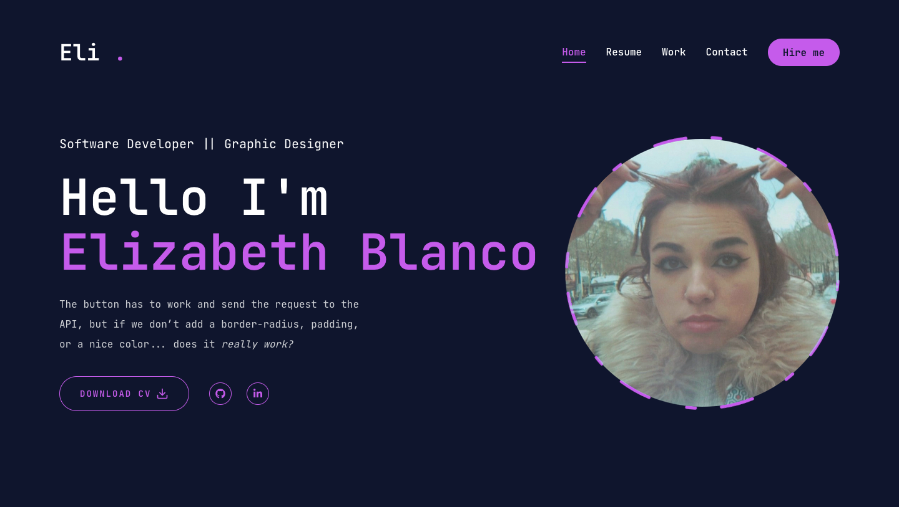

# ✨ Elizabeth Blanco | Portfolio 🚀

Hi! I'm Elizabeth Blanco, and this is my personal portfolio where I share my projects, skills, and a bit about myself.

---

## 📸 Preview


---

## 🛠️ Technologies Used
- **Next.js** (with App Router and Server Components)
- **React** and **Tailwind CSS**
- **Framer Motion** for smooth animations

---

## 🎨 Key Features
✅ Minimalist and elegant design  
✅ Smooth page transitions  
✅ Fully responsive and accessible  
✅ Clean and modular code  

---

## 🚀 Deployment
You can view the live project here 👉 [https://eliblanco-portfolio.vercel.app/](https://eliblanco-portfolio.vercel.app/) 

---


## 👩‍💻 Why this project?
I wanted to create a space to showcase my work and share a bit about me, but also to experiment with:
- **Next.js 14** and its latest features
- Trying **React.js and Tailwind** for the first time
- Best practices for accessibility and SEO

---

## 📬 Contact Me
If you want to work together or just say hi, feel free to reach out:  
💌 **Email:** [elizabethblancomendez97@gmail.com](elizabethblancomendez97@gmail.com)  
💼 **LinkedIn:** [linkedin.com/in/elizabeth-blanco-méndez-ab7014219/](https://linkedin.com/in/elizabeth-blanco-méndez-ab7014219/)  

---

## ⚡ Running locally

```bash
# 1️⃣ Clone this repository
git clone https://github.com/mychemicalEli/portfolio.git

# 2️⃣ Navigate into the project folder
cd portfolio

# 3️⃣ Install dependencies
npm install

# 4️⃣ Run the development server
npm run dev

# The project will be available at http://localhost:3000

---